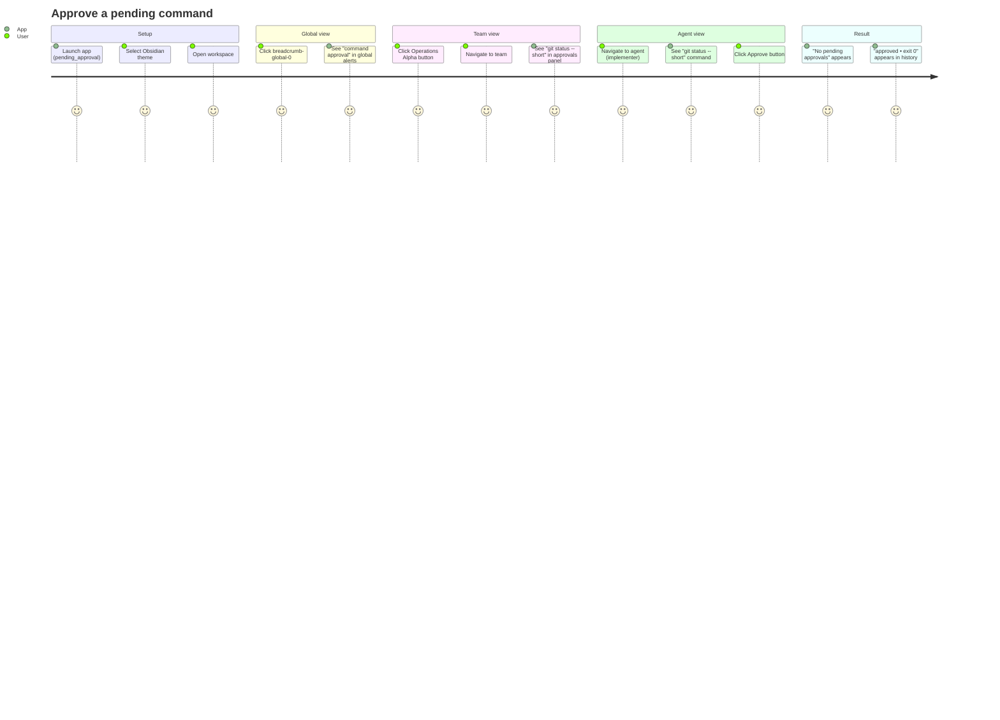
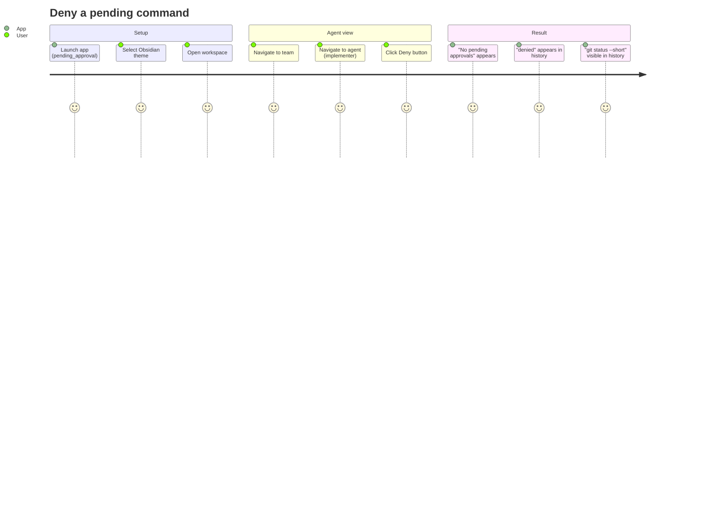
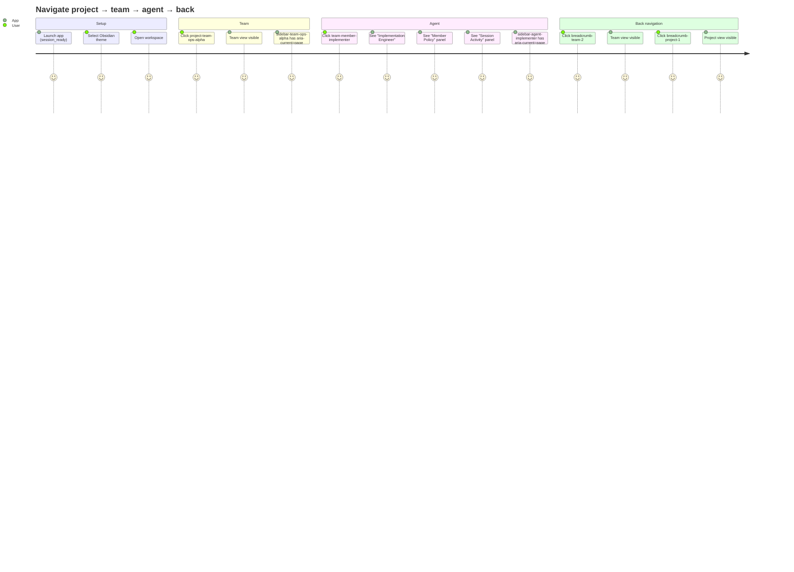
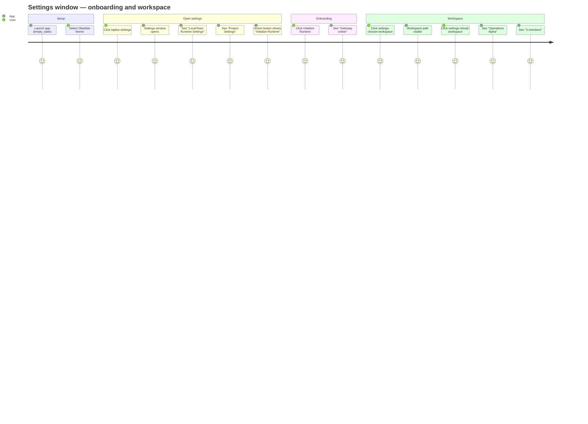
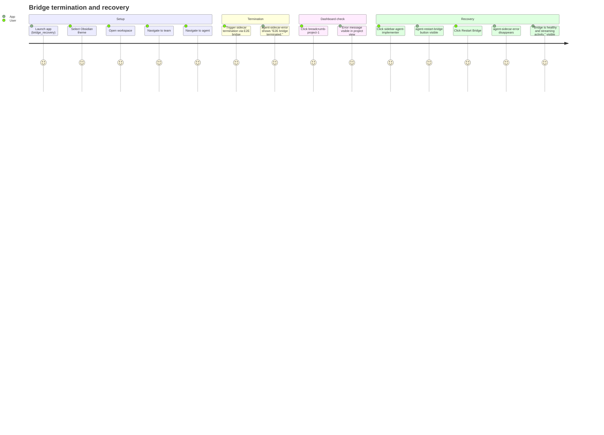
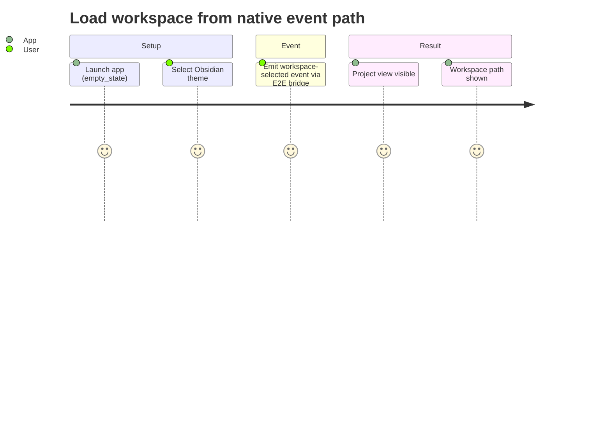
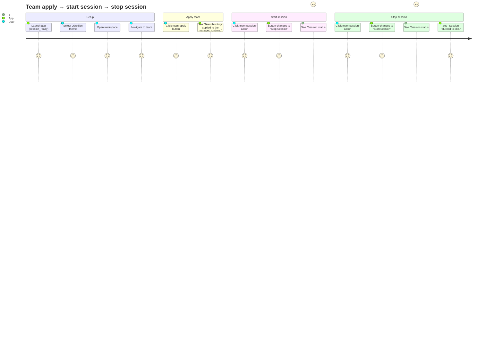
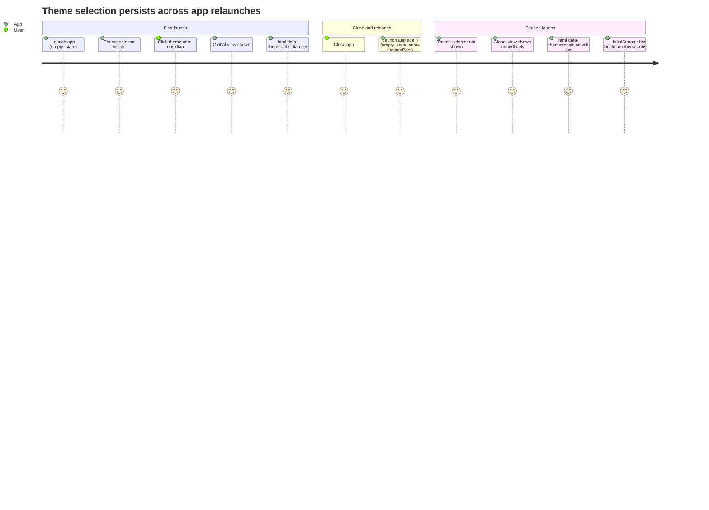
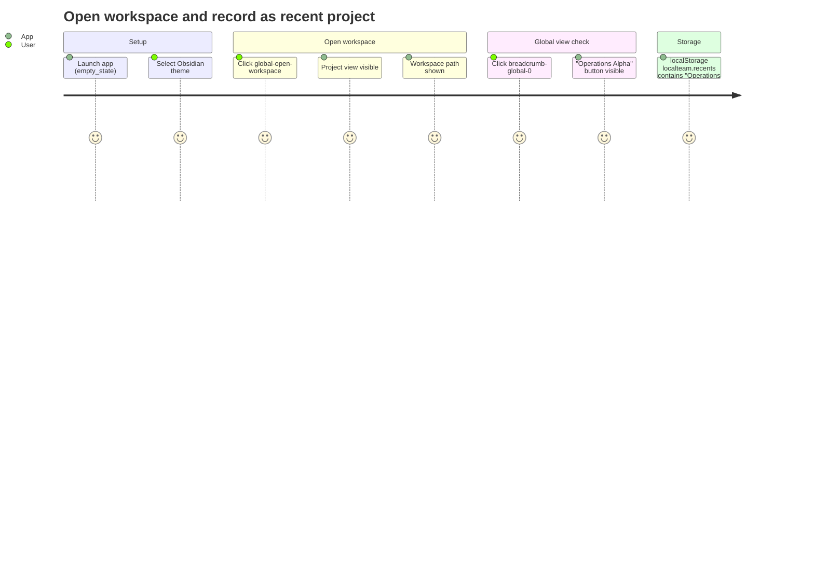

# Functional Test Suite

Playwright end-to-end tests that launch the full LocalTeam Tauri application via WebView2 CDP and exercise real user journeys. All tests require Windows and are skipped on other platforms.

## Running

```bash
# Run all tests (headless)
npm run test:functional

# Run with visible browser window
npm run test:functional:headed
```

Test output, traces, and screenshots are written to `output/playwright/`.

---

## Test Files

### `approvals.spec.ts`

#### Approve a pending command



#### Deny a pending command



---

### `navigation-settings.spec.ts`

#### Navigate project → team → agent and back



#### Settings window — runtime onboarding and workspace selection



---

### `recovery.spec.ts`

#### Bridge termination surfaces and recovers



#### Workspace loaded via native workspace-selected event



---

### `session-lifecycle.spec.ts`

#### Team apply and session start/stop



---

### `theme-workspace.spec.ts`

#### Theme persists across relaunches



#### Open workspace and record recent project



---

## Test Infrastructure

### `support/tauriHarness.ts`

Launches a full Tauri dev build per test via `npm run tauri -- dev --config src-tauri/tauri.e2e.conf.json --no-watch` with WebView2 CDP enabled on a free port. Each test gets an isolated `runtimeRoot` directory for `appdata` and WebView2 profile data.

| Export | Purpose |
|---|---|
| `createRuntimeRoot()` | Creates a temp directory scoped to the test |
| `launchLocalTeam(options)` | Spawns the app and returns a `LocalTeamApp` handle |
| `cleanupRuntimeRoot(path)` | Removes the temp directory after the test |

### `support/helpers.ts`

Shared step helpers used across spec files.

| Helper | What it does |
|---|---|
| `selectObsidianTheme(page)` | Clicks the Obsidian theme card and waits for the global view |
| `openWorkspace(page)` | Clicks `global-open-workspace` and waits for the project view |
| `goToTeam(page)` | Clicks `project-team-ops-alpha` and waits for the team view |
| `goToAgent(page)` | Clicks `team-member-implementer` and waits for the agent view |
| `emitWorkspaceSelected(page, path?)` | Fires the `workspace-selected` native event via the E2E bridge |
| `triggerSidecarTermination(page, detail?)` | Triggers a simulated sidecar crash via the E2E bridge |

### E2E Scenarios

Tests pass a `scenario` option to `launchLocalTeam` which controls the simulated backend state:

| Scenario | Description |
|---|---|
| `empty_state` | App launched with no workspace loaded and runtime not onboarded |
| `session_ready` | Workspace loaded, runtime onboarded, no active session |
| `pending_approval` | Like `session_ready` with one pending command approval for the implementer agent |
| `bridge_recovery` | Like `session_ready` with an active session, used for bridge termination tests |
